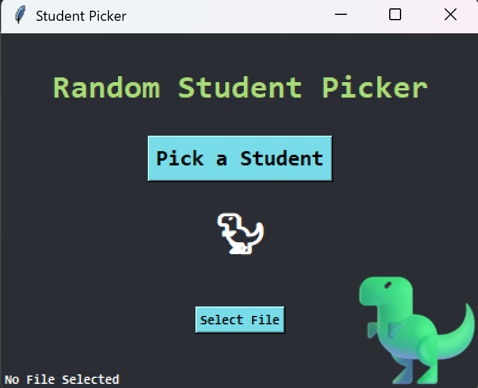
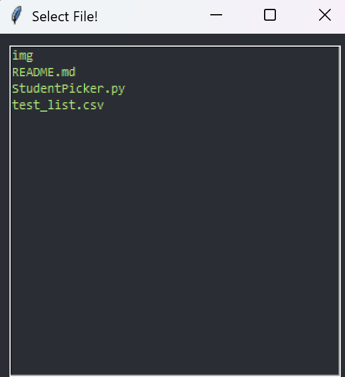

# Random Student Picker 🦖

Welcome to **Random Student Picker**, an interactive way to select a student at random! Whether you're a teacher looking to spice up your classroom participation or just someone who loves surprises, this app is for you.  

---

## Table of Contents

- [About](#about)
- [Features](#features)
- [Installation](#installation)
- [Usage](#usage)
- [Screenshots](#screenshots)

---

## About

Simple Python application built with [Tkinter](https://docs.python.org/3/library/tkinter.html) for the GUI, [Pandas](https://pandas.pydata.org/) for handling CSV files, and [Pillow](https://python-pillow.org/) for image processing. The app randomly selects a student from your provided list, ensuring that everyone gets a chance until all names have been picked—at which point, it resets and starts over!

---

## Features

- **Interactive GUI:** A clean and colorful interface powered by Tkinter.
- **CSV File Support:** Easily load your list of students from a CSV file.
- **Random Selection:** Picks a random student each time you press the button.
- **Cycle Reset:** Automatically resets once every student has been selected.
- **Fun Theme:** With a playful T-Rex icon to add some extra excitement!
- **Change Themes** Change themes easily by replacing color values to global variables.

---

## Installation

1. **Clone the repository:**

    ```bash
   git clone https://github.com/on3moy/Student_Picker_Tkinter.git
   cd random-student-picker
    ```

2. Install the required dependencies:

    Make sure you have Python 3 installed. Then install the required Python libraries:

    ```bash
    pip install pandas pillow
    ```

**Note**: Tkinter usually comes pre-installed with Python. If not, install it via your system’s package manager.

### Dependencies
python 3.13 comes with Tkinter!  

```bash
pip install pillow pandas
```

---

## Usage

Prepare your CSV file.  

1. Create a CSV file containing your student names. For best results, the CSV should have no header and list the student names in the first column. For example:  

    ```csv
    Alice
    Bob
    Charlie
    David
    ```
2. Run the app.

    ```bash
    python student_picker.py
    ```

### The backend code that picks up the list

```python
# You can see this only pulls the first column, you can adjust to your liking!
df = pd.read_csv(file_name, header=None, usecols=[0])
student_names = df.iloc[:, 0].to_list()
```

---

## Screenshots

Main Window  
   

Pop-up window to pick file  
  